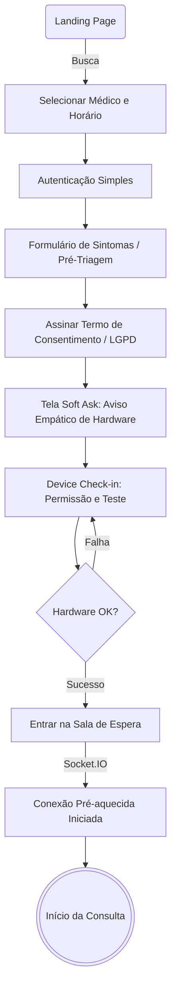
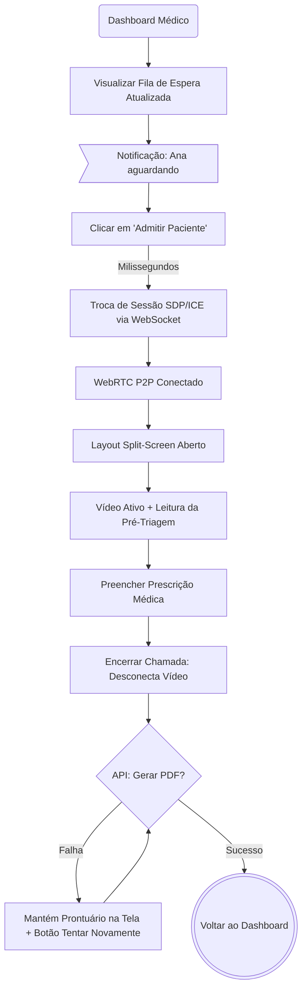

# UX Design Specification ImNotMedical

**Author:** Rafa
**Date:** 2026-05-12

---

<!-- UX design content will be appended sequentially through collaborative workflow steps -->

## Executive Summary

### Project Vision

O ImNotMedical é uma plataforma acadêmica de telemedicina de nível profissional que replica fielmente o fluxo completo de teleconsulta entre médicos e pacientes. Construída com um stack moderno (NestJS, Next.js 14, WebRTC) e arquitetura de custo zero, seu objetivo principal é demonstrar excelência técnica, domínio em comunicação em tempo real e compliance regulatório visual (CFM 2.314/2022, LGPD) para servir como um case e portfólio de altíssimo nível para o desenvolvedor.

### Target Users

- **Paciente Simulado (Ex: Ana):** Pessoas buscando atendimento médico remoto simples e acessível. Com familiaridade tecnológica média, precisam de uma interface altamente intuitiva, guiada e que transmita confiança institucional.
- **Médico Simulado (Ex: Dr. Carlos):** Profissionais de saúde buscando flexibilidade para expandir atendimentos. Precisam de um fluxo de trabalho unificado que integre agenda, pré-triagem, vídeo, prontuário eletrônico e prescrição sem atrito burocrático.
- **Avaliador/Recrutador (Ex: Lucas - Usuário Final Real):** Profissionais técnicos avaliando a qualidade do projeto. Precisam de uma experiência de demonstração fluida (ex: testar médico e paciente em duas abas simultâneas), identificando facilmente a solidez técnica e a excelência em UX/UI.

### Key Design Challenges

- **Orquestração de Estados em Tempo Real:** Transitar suavemente da sala de espera para a conexão WebRTC P2P, lidando com quedas de rede e reconexões automáticas (ICE restarts) de forma elegante e amigável, sem deixar o usuário em telas brancas ou de erro genérico.
- **Compliance Visual sem Atrito:** Integrar passos regulatórios e técnicos obrigatórios (termo de consentimento, verificação de câmera e microfone, LGPD) de maneira que fortaleçam a percepção de "produto real" sem burocratizar excessivamente a jornada do paciente.
- **"Demoability" (Facilidade de Demonstração):** A UX deve ser desenhada para brilhar quando testada em um cenário solo (uma pessoa usando duas abas lado a lado). Isso exige feedbacks de estado impecáveis, responsividade instantânea e tratativas de loading (como o cold start do Render) que ajudem a guiar o avaliador.

### Design Opportunities

- **Workspace Integrado do Médico:** Desenhar uma interface de teleconsulta que consolide de forma ergonômica a chamada de vídeo, o chat, o contexto da pré-triagem e o preenchimento do prontuário em uma única tela de alta eficiência.
- **Fluxo de Agendamento e Pré-Triagem Premium:** Criar uma jornada guiada e fluida desde a busca do médico até o preenchimento dos sintomas na pré-triagem, elevando a percepção de empatia e cuidado do produto.
- **Feedback Preventivo e Construção de Confiança:** Utilizar micro-interações, verificações prévias de hardware (câmera/mic) e loading states elegantes para reduzir a ansiedade do paciente antes mesmo da consulta começar.

## Core User Experience

### Defining Experience
A experiência central do ImNotMedical é a transição impecável da jornada assíncrona (busca, agendamento, pré-triagem) para a comunicação síncrona em tempo real (videochamada P2P). A ação vital que define o sucesso do produto é a "conexão": o momento em que o médico admite o paciente da sala de espera e o vídeo se estabelece em segundos, conectando duas pontas remotas com estabilidade, confiança e sem fricção.

### Platform Strategy
A plataforma é um Web App Responsivo desenhado com dupla prioridade: desktop-first para o médico e mobile-first para o paciente. O foco é 100% web browser, dependendo intensamente de APIs modernas (WebRTC, `getUserMedia`). No mobile, a interface da consulta deve mimetizar o comportamento de um app nativo (controles flutuantes, picture-in-picture e chat em overlays). O design contará com transições CSS nativas (sem libs pesadas de animação) para manter a performance imaculada e o bundle extremamente leve.

### Effortless Interactions
- **Loading Narrativo Premium:** Em vez de spinners genéricos, o carregamento inicial prolongado (cold start do Render) exibe um skeleton loading elegante acompanhado de mensagens fade-in que revelam a arquitetura sendo inicializada (ex: "Acordando o Gateway NestJS...", "Estabelecendo Workers..."). Transforma uma limitação de infraestrutura em demonstração técnica de alto nível.
- **Check-in Anti-Frustração:** A verificação prévia de hardware é à prova de erros. O usuário recebe feedback em tempo real e visual, erradicando o problema do "você está me ouvindo?".
- **Reconexões Invisíveis:** Oscilações de rede acionam reconexões (ICE restarts) totalmente transparentes com avisos refinados, sem exigir atualizações na página.
- **Geração de Documentos "One-Click":** Assinar e enviar prescrição digital ocorre quase sem cliques.

### Critical Success Moments
- **O Momento "Aha!" do Recrutador (Demoability):** Quando o avaliador abre duas abas lado a lado e testemunha a conexão WebRTC se formar instantaneamente (em <3s), acompanhada de animações e micro-interações cravadas a 60fps.
- **O Acolhimento na Sala de Espera:** A entrada suave na sala após a pré-triagem, com status dinâmico ("Aguardando Dr. Carlos... O médico já foi notificado"), reduzindo a ansiedade do paciente instantaneamente.

### Experience Principles
1. **Compliance como Cuidado, não Fricção:** Passos regulatórios (LGPD, consentimento) transmitem ética clínica e valor, não burocracia.
2. **Micro-interações Enxutas (Design Premium):** Foco em design minimalista, tipografia excelente e CSS puro para transições (`opacity`, `transform`). Garante uma estética luxuosa sem penalizar a velocidade.
3. **Transparência Absoluta de Estado:** O usuário nunca é deixado no escuro; de problemas de rede à inicialização do servidor, o sistema domina o diálogo.
4. **Cockpit Médico Integrado:** O layout de teleconsulta consolida vídeo, chat, triagem e prontuário no mesmo viewport ergonômico.

## Desired Emotional Response

### Primary Emotional Goals
- **O Paciente:** Deve se sentir *amparado*, *seguro* e *aliviado*. A ansiedade natural de uma consulta médica deve ser substituída pela sensação de estar nas mãos de uma clínica premium.
- **O Médico:** Deve se sentir *no controle*, *produtivo* e *focado*. A interface deve parecer uma extensão natural do seu raciocínio clínico, não um obstáculo burocrático.
- **O Recrutador/Avaliador:** Deve se sentir *impressionado* e *intrigado*. A emoção primária é o respeito técnico ao perceber a complexidade operando por trás de uma fachada extremamente simples.

### Emotional Journey Mapping
- **Descoberta e Agendamento:** Da curiosidade à confiança imediata. O layout limpo, os perfis profissionais e o fluxo sem atrito estabelecem credibilidade.
- **Sala de Espera (O Pico de Ansiedade):** Resolvemos com check-in visual e sala dinâmica ("O médico já foi notificado"), convertendo ansiedade em tranquilidade.
- **Durante a Consulta:** Imersão e foco. A interface "desaparece", permitindo a conexão humana.
- **Pós-Consulta:** Sensação de dever cumprido e encantamento ("A receita em PDF já está aqui!").

### Micro-Emotions
- **Confiança vs. Dúvida:** Garantida pelo teste de dispositivos pré-consulta e feedback em tempo real.
- **Paciência vs. Frustração:** O "Loading Narrativo" converte a frustração da lentidão em curiosidade técnica.
- **Seriedade vs. Banalidade:** Termos de consentimento tratados com elegância evocam respeito e não incômodo.

### Design Implications
- **Cores e Tipografia (Boutique de Saúde):** Uso de paletas que fujam do "azul hospitalar frio" adotando tons acinzentados (slate), terrosos ou azuis profundos, com muito espaço em branco, passando a sensação de uma clínica boutique premium e acolhedora.
- **Micro-copy e Tom de Voz Clínico:** A linguagem da plataforma é transparente, respeitosa e assume responsabilidades. Em vez de "Erro 500" ou "Sua rede caiu", usamos "Sua conexão oscilou. Estamos tentando reconectar você..."
- **Erros Empáticos (Fallback UI):** Nenhum erro técnico deve quebrar a tela. Componentes de fallback elegantes ("Tentar novamente") protegem a confiança do usuário.
- **Minimalismo na Chamada:** Controles desaparecem na inatividade para priorizar a conexão humana.

### Emotional Design Principles
1. **Calmaria Impulsionada por Tecnologia:** A tecnologia deve absorver a ansiedade do processo, não ser a fonte dela.
2. **Profissionalismo por Padrão:** Do micro-copy ao skeleton loader, tudo deve exalar o cuidado de uma clínica de alto nível.
3. **Capacidade Transparente:** Mostrar que o sistema trabalha duro (reconexões, cold starts) sem transformar isso em fardo cognitivo.

## UX Pattern Analysis & Inspiration

### Inspiring Products Analysis
1. **Doctor on Demand (Referência para o Fluxo da Consulta):**
   - *Sucesso de UX:* Resolve a fricção técnica. O onboarding de hardware é à prova de erros. A sala de espera transmite a sensação de ambiente real. A interface de vídeo é limpa, priorizando a conexão humana e ocultando jargões.
2. **Doctoralia (Referência para Marketplace e Agendamento):**
   - *Sucesso de UX:* Constrói confiança instantânea na descoberta. A exibição de credenciais e a agenda no formato "tira de dias" (calendar strip) são padrões ouro em intuitividade.

### Transferable UX Patterns
**Padrões de Navegação:**
- **Card de Descoberta:** Layout para médicos contendo foto, nome, CRM e o "próximo horário disponível" em destaque.
- **Calendar Strip Nativo:** Seletor de horários em carrossel horizontal de 7 dias, implementado com scroll nativo (`overflow-x: auto` e `scroll-snap`) e `date-fns`, evitando bibliotecas de calendário pesadas para favorecer a performance.

**Padrões de Interação:**
- **Device Check-in Modal:** Tela pre-flight obrigatória mostrando preview de vídeo e barras de áudio se movendo.
- **Split-Screen do Médico:** Em desktop, um layout assimétrico onde o vídeo do paciente ocupa 60% da tela e um painel limpo ocupa 40% com o prontuário. *Aviso arquitetural:* O estado do formulário (prontuário) deve ser estritamente isolado do componente de vídeo (usando Context/Zustand) para evitar re-renders e interrupções na chamada durante a digitação.

### Anti-Patterns to Avoid
- **A "Síndrome de Reunião Corporativa":** Evitar layouts e controles que remetam a ferramentas como Zoom/Teams. O ambiente deve ser estritamente clínico.
- **Permissões de Última Hora:** Requisitar câmera/microfone apenas no instante da chamada. Isso deve ser feito e garantido antes da sala de espera.
- **Jargão Médico para Pacientes:** O uso de CID-10 e termos técnicos fica restrito à visão do médico (prontuário).

### Design Inspiration Strategy
- **Adotar:** A estrutura de calendário em slots inspirada na Doctoralia e o fluxo seguro de check-in de hardware do Doctor on Demand.
- **Adaptar:** O padrão Split-Screen para um cockpit de alta produtividade para o médico, mantendo isolamento rígido de estado no Next.js.
- **Evitar:** UIs poluídas com botões de conferência irrelevantes e lentidão causada por bibliotecas excessivas.

## Design System Foundation

### 1.1 Design System Choice
**Tailwind CSS combinado com shadcn/ui (Radix UI primitives).**

### Rationale for Selection
- **Performance Extrema (Bundle Enxuto):** O `shadcn/ui` não adiciona uma megabiblioteca ao bundle final. O Tailwind compila apenas o CSS utilizado, garantindo tempos de carregamento mínimos e o cumprimento do target de performance para o cold start.
- **Sinalização de Mercado (Recrutamento):** Dominar Tailwind e shadcn/ui no ecossistema Next.js (App Router) demonstra conhecimento das melhores práticas modernas de front-end.
- **Acessibilidade "Out-of-the-box":** O uso de primitivas do Radix UI garante que modais, dropdowns e formulários tenham suporte perfeito a leitores de tela e navegação por teclado (WCAG) sem esforço adicional.
- **Controle Visual Total ("Boutique Feel"):** Por termos a posse do código do componente, podemos aplicar a paleta clínica e contornos suaves sem lutar contra a especificidade de bibliotecas pré-fabricadas.

### Implementation Approach
- **Tokens de Design no Tailwind:** Variáveis de cor (`primary`, `background`, `destructive` para erros empáticos) no `tailwind.config.js` e `globals.css` via CSS variables para fácil manutenção.
- **Componentes "Copy-paste":** Uso da CLI do shadcn (`npx shadcn-ui@latest add [componente]`) para trazer componentes estruturais como Dialog (verificação de hardware) e Form (prontuário).

### Customization Strategy
- **Tematização Boutique:** Bordas duras substituídas por `radius` suaves (ex: `0.5rem`). Sombras espalhadas para criar profundidade elegante, evitando contrastes pesados.
- **Animações Nativas Suavizadas:** Modificaremos os tempos de animação padrão do shadcn (especialmente em modais e toasts de notificação) usando classes do Tailwind como `duration-500` e `ease-in-out`. A entrada e saída de elementos deve ser propositalmente lenta e fluida, para não "assustar" o paciente ou parecer um alerta abrupto do sistema.

## Defining Core Interaction

### 2.1 Defining Experience
A interação central que define o sucesso do ImNotMedical é o **"Handshake Clínico"**: o exato segundo em que o médico clica em "Admitir Paciente" e a sala de espera se transforma em uma videochamada de alta qualidade, revelando o cockpit médico integrado. Se acertarmos a fluidez e a estabilidade desse momento, a confiança no sistema é estabelecida imediatamente (tanto para o paciente quanto para o avaliador/recrutador).

### 2.2 User Mental Model
- **O Paciente:** Traz o modelo mental de uma clínica física. Ele espera se identificar (triagem), sentar na recepção (sala de espera) e ser chamado pelo médico. A frustração ocorre quando a "sala de espera" digital parece uma tela travada.
- **O Médico:** Traz o modelo mental da sua mesa de trabalho. Ele espera ter o paciente na sua frente e seu bloco de notas ao lado, sem alternar abas.
- **O Recrutador:** Tem o modelo mental de um testador de software. Ele vai abrir o app do paciente e do médico lado a lado na tela e testar se o WebSocket e o WebRTC aguentam o tranco.

### 2.3 Success Criteria
A experiência central será considerada um sucesso se:
1. A transição da sala de espera para o vídeo ativo ocorrer em **menos de 3 segundos** após o aceite do médico.
2. O momento "Você está me ouvindo?" for erradicado graças ao check-in obrigatório de hardware.
3. O recrutador conseguir usar o sistema com eficiência operando duas abas na mesma tela de notebook, sem o layout do Cockpit Médico "quebrar".

### 2.4 Novel UX Patterns
Estamos usando tecnologias estabelecidas, mas com uma integração inovadora para este escopo:
- **Cockpit Médico Isolado:** A combinação de vídeo WebRTC e formulário em um único *Split-Screen* reativo, sem re-renders que pisquem o vídeo.
- **Conexões Pré-aquecidas (Pre-warmed P2P):** Iniciar a negociação WebRTC silenciosamente enquanto o paciente está na sala de espera, garantindo que o handshake final ocorra em milissegundos.

### 2.5 Experience Mechanics
O fluxo passo a passo dessa interação central:
1. **Initiation:** O paciente entra na "Sala de Espera". O sistema engatilha o Socket.IO e começa a preparar os ICE candidates (Conexão Pré-aquecida). O médico recebe um toast suave.
2. **Interaction:** O médico clica em "Admitir Ana". Apenas as descrições de sessão (SDP) finais são trocadas de imediato.
3. **Feedback (Coreografia Audiovisual):** A tela transiciona com um fade-out da sala de espera. O canal de áudio é aberto milissegundos antes do vídeo, permitindo ouvir o "Olá, Ana!" enquanto o vídeo faz fade-in suavemente.
4. **Completion:** Chamada estabelecida. O painel lateral do médico (Prontuário) é destravado.

## Visual Design Foundation

### Color System (Tema "Clínica Boutique")
- **Background Principal:** Off-white suave (`Slate 50` - `#f8fafc`).
- **Brand/Texto Primário:** Azul acinzentado profundo (`Slate 800` - `#1e293b`).
- **Accent/Ação:** Teal mutado/Verde Sálvia (`Teal 600` - `#0d9488`).
- **Cores Semânticas (Empatia):** O vermelho para encerramento será um terracota quente (`Red 700`).
- **Dark Mode Nativo (Ergonomia Médica):** Suporte nativo `prefers-color-scheme` via Tailwind para garantir legibilidade (fundo Slate 900, texto Slate 300) durante plantões noturnos, elevando a percepção de produto final.

### Typography System
- **Typeface Primária:** `Inter` (ou `Geist`). Otimizada para legibilidade técnica e moderna.
- **Hierarquia:** Headings pesados (Bold/Semibold) com tracking reduzido; Body Text com line-height generoso (`1.6`) para leitura rápida de sintomas.

### Spacing & Layout Foundation
- **Sistema Base:** Grid de 8px (padrão Tailwind).
- **Filosofia de Espaço:** *Airy and spacious*. Margens internas (paddings) generosas.
- **Princípios de Layout:** Containers centralizados (`max-w-7xl`) para agendamento; Cockpit Médico em tela cheia (`100vw / 100vh`) sem bordas para produtividade máxima.

### Accessibility Considerations
- **Contraste de Texto:** Todo texto e cor de fundo devem passar no nível WCAG AA.
- **Focus Rings:** Extremamente visíveis (`ring-2 ring-teal-500 ring-offset-2`) para uso eficiente de teclado (TAB) pelo médico.

## Design Direction Decision

### Design Directions Explored
1. **Direction A (Minimalist Paper):** Foco em alto contraste, fundos limpos (Slate 50) e clareza.
2. **Direction B (Glass Clinic):** Visual ultratecnológico com `backdrop-blur` e glassmorphism.
3. **Direction C (Cozy Dark Mode):** Ergonomia noturna focada com fundos profundos (Slate 900) e sálvia/teal contido.

### Chosen Direction
**Combinação das Direções A (Minimalist Paper) e C (Cozy Dark Mode).** O sistema adotará a estética sólida e limpa da Direção A como padrão "Light", e alternará automaticamente para a Direção C baseado na preferência do sistema operacional (`prefers-color-scheme`), dispensando a Direção B (Glass Clinic).

### Design Rationale
- **Performance de Renderização (UX vs CPU):** A decisão de descartar o uso de `backdrop-filter: blur()` (Direção B) se baseia puramente na otimização da performance do navegador. O Glassmorphism em cima de componentes pesados (WebRTC decoding) causa spikes de processamento na GPU, resultando em quedas de framerate no vídeo. Cores sólidas (Direções A e C) garantem a fluidez de 60fps na nossa Experiência Central.
- **Autoridade e Foco:** O alto contraste e os fundos limpos transmitem a assepsia de um ambiente clínico real, suportando o foco do médico sem modismos.

### Implementation Approach
O design usará a configuração base do Tailwind para `light` e `dark`. Nenhuma biblioteca extra de componentes visuais pesados será adotada. Foco total nas primitivas de borda suave (`rounded-lg`), paleta de cores `Slate` e sombras precisas (`shadow-sm` no light mode, ausência de sombras no dark mode).

## User Journey Flows

### 1. A Jornada do Paciente: Do Agendamento à Sala de Espera
Foca em resolver a fricção técnica antes da consulta começar.

### 2. A Jornada do Médico: O Cockpit de Atendimento
Focada em extrema produtividade, sem se perder em menus, e prevenindo perda de dados em falhas de rede.

### Journey Patterns
- **Progressive Disclosure:** A triagem, consentimento e check-in são fatiados em *steps* focados. O "Soft Ask" antes do popup nativo do navegador é um exemplo máximo desse padrão.
- **Pre-flight Checks Obrigatórios:** Nenhuma comunicação começa sem validação ativa do hardware.
- **Estado Dinâmico Invisível:** A reconexão e o pré-aquecimento do WebRTC acontecem "por baixo dos panos".

### Flow Optimization Principles
1. **Minimizar "Time-to-Value" Médico:** O médico chega na consulta já com o contexto preenchido pela pré-triagem do paciente.
2. **Prevenir a Síndrome "Estou mudo?":** O *Device Check-in* elimina o ofensor principal de tempo.
3. **Resiliência Arquitetural (Fallback PDF):** Separar o encerramento do vídeo (imediato, limpa memória) do encerramento lógico da consulta (requisição de rede para PDF), mantendo o formulário salvo em caso de falha.

## UX Consistency Patterns

### Button Hierarchy
- **Primary Action:** Solid Teal (`bg-teal-600`). Regra rígida: Máximo de UM por tela.
- **Secondary Action:** Outline Slate. Para navegação e ações alternativas (ex: "Voltar").
- **Destructive Action:** Solid Red Mutado. Ações irreversíveis (ex: "Encerrar Chamada").
- **Loading State:** O botão ativa o estado `disabled` com um spinner nativo elegante (`lucide-react`), sem bloquear a UI com popups de carregamento.

### Feedback Patterns (Empathetic Errors)
- **Success:** Toasts transitórios (3 segundos) no canto inferior direito.
- **Warning (Rede Oscilando):** Toast ou Banner não-bloqueante alertando instabilidade.
- **Critical Error:** *Inline Banner* contextual com ação de "Tentar Novamente". NUNCA usar `alert()` nativo.
- **Loading Narrativo:** Para esperas > 1.5s, usar um Wrapper global (`<Suspense>` ou análogo) que injeta Skeletons e cicla mensagens de status de arquitetura ("Estabelecendo túnel seguro...").

### Form Patterns
- **Layout:** *Top-aligned labels* para escaneabilidade médica rápida.
- **Validation:** Erros vermelhos suaves embaixo do campo. A borda só fica vermelha no `onBlur` (saída do campo) ou `onSubmit`, nunca no `onChange` enquanto o usuário digita.

### Navigation Patterns
- **Jornada do Paciente:** "Wizard" Linear. Fluxo focado, sem sidebars ou distrações globais.
- **Jornada do Médico:** "Dashboard" padrão com Sidebar. Porém, no *Split-Screen Cockpit*, a navegação some para foco total.
- **Bail Out (Saída de Emergência):** Botão secundário discreto na tela de vídeo para forçar um *Hard Teardown* (destruição do WebRTC e liberação de câmera) caso o usuário entre em pânico por congelamento de rede.

## Responsive Design & Accessibility

### Responsive Strategy
- **Jornada do Paciente (Mobile-First):** Foco nativo no celular. Inputs grandes para toque, *scroll-snap* horizontal e ausência de dependência de *hover*. No desktop, a interface centraliza (max-w-md ou max-w-xl).
- **Jornada do Médico (Desktop-First):** O *Cockpit Split-Screen* exige largura (60% vídeo / 40% prontuário). 
- **Mobile Cockpit (Fallback do Médico):** Se o médico acessar via celular (`< 768px`), o vídeo da chamada adere ao topo da tela (`sticky top-0 z-50`) enquanto o painel do prontuário fica rolável por baixo. O contato visual nunca é perdido.

### Breakpoint Strategy
Uso estrito dos breakpoints do Tailwind:
- `sm: 640px` (Mobiles Grandes): Botões ocupam 100% da largura.
- `md: 768px` (Tablets): Transição de layouts empilhados para lado a lado.
- `lg: 1024px` (Desktop): Breakpoint alvo para o Cockpit (Split-Screen completo).

### Accessibility Strategy (WCAG AA)
- **Contraste de Cor:** `Slate 800` sobre `Slate 50` excede 4.5:1. Suporte a Dark Mode ergonômico.
- **Audible State:** `aria-pressed="true"` obrigatório nos controles de mídia (Mudo/Câmera) e `aria-live` no loading narrativo.
- **Tab-Only Test:** O médico deve poder preencher o prontuário usando apenas o teclado. Os *focus rings* do Tailwind (`ring-2 ring-teal-500`) garantem a orientação visual. A gestão nativa de foco do `shadcn/ui` facilitará isso.

### Implementation Guidelines
- **CSS Mobile-First:** Classes base do Tailwind definem o mobile. Modificadores (`md:`, `lg:`) expandem layouts.
- **Touch Targets:** Área de clique mínima de `44x44px` (Tailwind `h-11 w-11` ou equivalente) em todos os botões e links.
